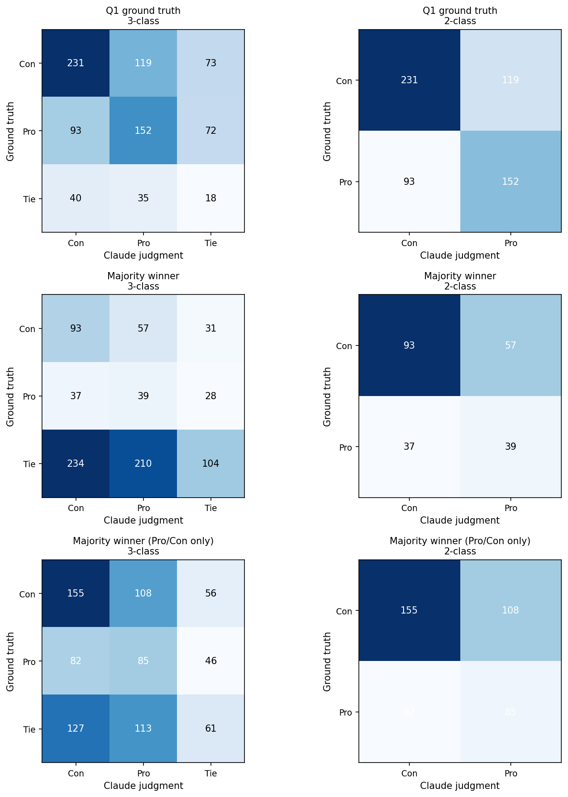
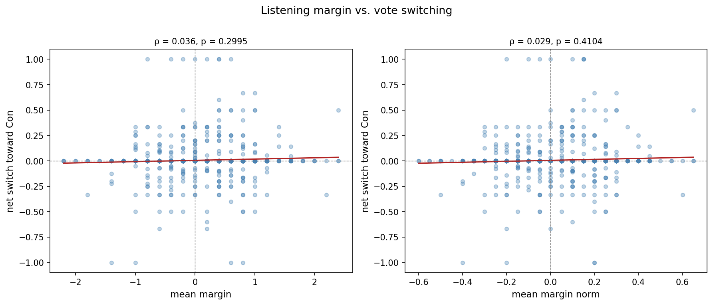
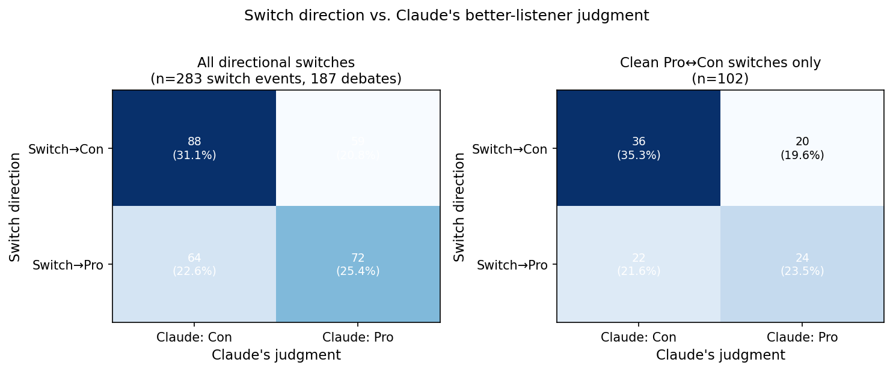
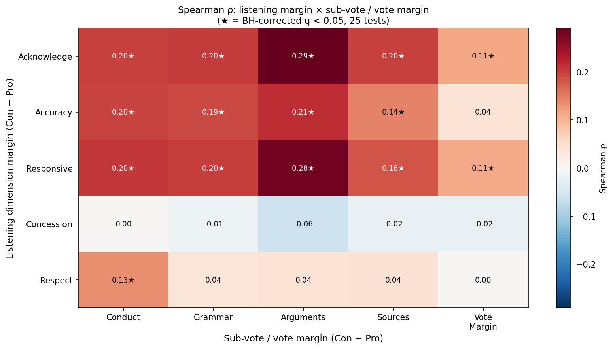

## Methods Note

All margin values follow a Con-positive sign convention: `margin = con_score − pro_score` for listening dimensions and `(n_Con − n_Pro) / n_votes` for vote margins. A positive listening margin indicates Con listened better; a positive vote margin indicates more voters sided with Con after the debate. The unit of analysis is the debate (unweighted). Vote switching toward Con is defined as the transitions Pro→Con, Pro→Tie, and Tie→Con; the mirror set (Con→Pro, Con→Tie, Tie→Pro) counts as switching toward Pro. `net_switch_toward_con = (n_toward_con − n_toward_pro) / n_votes`. The headline classification analysis uses the 2-class condition (Tie debates excluded from both Claude's output and the ground truth) to match the Phase 1 IAA framing; 3-class results are reported as robustness checks. Bootstrap 95% CIs use 2000 debate-level resamples (percentile method). The 5×4 heatmap reports uncorrected Spearman ρ with p-values; a Benjamini–Hochberg q-value column is included in the CSV and significant cells (q < 0.05) are starred on the figure. The heatmap is explicitly exploratory. Two operationalizations of majority winner from post-debate votes are reported: `majority_winner` uses a three-way plurality (the side with the most votes among Pro, Con, and Tie wins; if no side leads strictly, the outcome is Tie); `majority_winner_procon` ignores Tie votes and awards the debate to whichever of Pro or Con received more post-debate votes (Tie only when Pro = Con). Rescala et al. (2024) benchmark numbers (33.33% random, 60.69% majority, 60.50% GPT-4) are cited from their Table 2 and not reproduced here.

## Headline: Overall Winner Agreement

### 2-Class Results (Tie excluded)

| Ground truth | n | Accuracy (%) | 95% CI | Cohen's κ | 95% CI | Gwet's AC1 | Macro F1 |
|---|---|---|---|---|---|---|---|
| Q1 ground truth | 595 | 64.37 | [60.50, 68.40] | 0.2760 | [0.1991, 0.3525] | 0.2997 | 0.6373 |
| Majority winner | 226 | 58.41 | [52.21, 64.60] | 0.1250 | [0.0012, 0.2489] | 0.2131 | 0.5589 |
| Majority winner (Pro/Con only) | 430 | 55.81 | [51.40, 60.23] | 0.0956 | [0.0038, 0.1864] | 0.1391 | 0.5461 |

For comparison, Rescala et al. (2024) report a random baseline of 33.33%, a majority-vote baseline of 60.69%, and GPT-4 at 60.5% on their Table 2 RQ1 task. Claude's 2-class agreement with the Q1 ground truth reaches 64.37% accuracy.

### 3-Class Robustness

| Ground truth | n | Accuracy (%) | 95% CI | Cohen's κ | 95% CI | Gwet's AC1 | Macro F1 |
|---|---|---|---|---|---|---|---|
| Q1 ground truth | 833 | 48.14 | [44.65, 51.38] | 0.1587 | [0.1066, 0.2078] | 0.2520 | 0.4052 |
| Majority winner | 833 | 28.33 | [25.21, 31.33] | 0.0189 | [-0.0191, 0.0551] | -0.0620 | 0.2747 |
| Majority winner (Pro/Con only) | 833 | 36.13 | [32.89, 39.38] | 0.0440 | [-0.0032, 0.0895] | 0.0487 | 0.3481 |

## Vote Switching

The vote-switching analysis asks whether debates where Con listened better also saw more voters switch toward Con. `net_switch_toward_con` is positive when more voters moved toward Con than toward Pro.

### Composite listening margin

Mean listening margin (raw) vs. net switch toward Con: Spearman ρ = 0.0360 (95% CI [-0.0292, 0.1030]), p = 0.29954; Pearson r = 0.0524 (95% CI [-0.0112, 0.1173]), p = 0.13039. n = 833.0 debates.

### Per-dimension correlations (Spearman ρ with net_switch_toward_con)

| Listening dimension | ρ | 95% CI | p |
|---|---|---|---|
| margin_acknowledgment | 0.0414 | [-0.0225, 0.1030] | 0.23235 |
| margin_accuracy_of_representation | 0.0343 | [-0.0307, 0.0995] | 0.32244 |
| margin_responsiveness | 0.0457 | [-0.0205, 0.1095] | 0.18782 |
| margin_concession_and_common_ground | -0.0093 | [-0.0799, 0.0622] | 0.78963 |
| margin_respectful_engagement | 0.0231 | [-0.0466, 0.0937] | 0.50535 |

**Robustness:** Min-max-normalized mean margin: ρ = 0.0286 (95% CI [-0.0369, 0.0935]), p = 0.41037.

## Vote Switching: Conditional on Switching

The correlation analysis above tests whether debates where Con listened better also saw *more* net switching toward Con — but most voters do not switch at all, which dilutes the signal. This section asks a sharper question: **among voters who actually switched their vote, did they tend to move toward the side Claude identified as the better listener?** The unit of analysis here is the individual switch event (voter × debate). Bootstrap CIs resample at the debate level to respect within-debate clustering (all switchers in a debate share the same Claude judgment).

Total switch events across all 833 debates: 354 (from 235 debates that had at least one vote flip). After excluding debates where Claude's judgment was Tie: 283 switch events across 187 debates.

### Headline: switch direction vs. Claude judgment (Tie debates excluded)

| n switches | n debates | Accuracy (%) | 95% CI | Cohen's κ | 95% CI | Gwet's AC1 | Macro F1 |
|---|---|---|---|---|---|---|---|
| 283 | 187 | 56.54 | [50.00, 62.54] | 0.1282 | [-0.0029, 0.2483] | 0.1335 | 0.5640 |

Chi-square test of independence (switch direction × Claude judgment): χ²(1) = 4.1582, p = 0.04143.

### Robustness: clean Pro↔Con switches only

Restricting to voters who switched cleanly between Pro and Con (excluding Pro↔Tie and Tie↔Con transitions): n = 102 switch events. Accuracy = 58.82%, Cohen's κ = 0.1652.

## Per-Dimension × Per-Sub-Vote Heatmap

The following heatmap shows Spearman ρ between each listening-dimension margin (Con − Pro mean score) and each persuasion sub-vote margin ((n_Con − n_Pro) / n_votes on that sub-vote). This is an exploratory 5×4 analysis (20 simultaneous tests); starred cells (★) survive Benjamini–Hochberg correction at q < 0.05.

**BH-significant cells (q < 0.05):**

| Listening dim | Sub-vote | n | ρ | p | q |
|---|---|---|---|---|---|
| acknowledgment | more_convincing_arguments | 833 | 0.2908 | 0.00000 | 0.00000 |
| responsiveness | more_convincing_arguments | 833 | 0.2799 | 0.00000 | 0.00000 |
| accuracy_of_representation | more_convincing_arguments | 833 | 0.2142 | 0.00000 | 0.00000 |
| responsiveness | better_conduct | 833 | 0.2050 | 0.00000 | 0.00000 |
| acknowledgment | better_spelling_and_grammar | 833 | 0.2045 | 0.00000 | 0.00000 |
| responsiveness | better_spelling_and_grammar | 833 | 0.2016 | 0.00000 | 0.00000 |
| acknowledgment | most_reliable_sources | 833 | 0.1997 | 0.00000 | 0.00000 |
| acknowledgment | better_conduct | 833 | 0.1993 | 0.00000 | 0.00000 |
| accuracy_of_representation | better_conduct | 833 | 0.1958 | 0.00000 | 0.00000 |
| accuracy_of_representation | better_spelling_and_grammar | 833 | 0.1930 | 0.00000 | 0.00000 |
| responsiveness | most_reliable_sources | 833 | 0.1818 | 0.00000 | 0.00000 |
| accuracy_of_representation | most_reliable_sources | 833 | 0.1442 | 0.00003 | 0.00005 |
| respectful_engagement | better_conduct | 833 | 0.1344 | 0.00010 | 0.00015 |

**Full heatmap values:**

| Listening dim | Sub-vote | n | ρ | p | q (BH) |
|---|---|---|---|---|---|
| acknowledgment | better_conduct | 833 | 0.1993 | 0.00000 | 0.00000 ★ |
| acknowledgment | better_spelling_and_grammar | 833 | 0.2045 | 0.00000 | 0.00000 ★ |
| acknowledgment | more_convincing_arguments | 833 | 0.2908 | 0.00000 | 0.00000 ★ |
| acknowledgment | most_reliable_sources | 833 | 0.1997 | 0.00000 | 0.00000 ★ |
| accuracy_of_representation | better_conduct | 833 | 0.1958 | 0.00000 | 0.00000 ★ |
| accuracy_of_representation | better_spelling_and_grammar | 833 | 0.1930 | 0.00000 | 0.00000 ★ |
| accuracy_of_representation | more_convincing_arguments | 833 | 0.2142 | 0.00000 | 0.00000 ★ |
| accuracy_of_representation | most_reliable_sources | 833 | 0.1442 | 0.00003 | 0.00005 ★ |
| responsiveness | better_conduct | 833 | 0.2050 | 0.00000 | 0.00000 ★ |
| responsiveness | better_spelling_and_grammar | 833 | 0.2016 | 0.00000 | 0.00000 ★ |
| responsiveness | more_convincing_arguments | 833 | 0.2799 | 0.00000 | 0.00000 ★ |
| responsiveness | most_reliable_sources | 833 | 0.1818 | 0.00000 | 0.00000 ★ |
| concession_and_common_ground | better_conduct | 833 | 0.0035 | 0.91872 | 0.91872 |
| concession_and_common_ground | better_spelling_and_grammar | 833 | -0.0140 | 0.68558 | 0.72166 |
| concession_and_common_ground | more_convincing_arguments | 833 | -0.0594 | 0.08683 | 0.12404 |
| concession_and_common_ground | most_reliable_sources | 833 | -0.0211 | 0.54400 | 0.60444 |
| respectful_engagement | better_conduct | 833 | 0.1344 | 0.00010 | 0.00015 ★ |
| respectful_engagement | better_spelling_and_grammar | 833 | 0.0355 | 0.30548 | 0.35939 |
| respectful_engagement | more_convincing_arguments | 833 | 0.0406 | 0.24125 | 0.30156 |
| respectful_engagement | most_reliable_sources | 833 | 0.0413 | 0.23364 | 0.30156 |

## Continuous: Listening Margin vs. Post-Debate Vote Margin

Spearman ρ = 0.0721 (95% CI [0.0024, 0.1363]), p = 0.03743. Pearson r = 0.0813 (95% CI [0.0132, 0.1462]), p = 0.01892. n = 833 debates. Here `vote_margin = (n_Con_after − n_Pro_after) / n_votes`.

## Logistic Regression: Predicting Majority Winner

Logistic regression of majority winner (Con = 1, Pro = 0; Tie debates excluded) on the five listening-dimension margins. Reported with coefficients, standard errors, p-values, and 95% CIs from statsmodels.

| Feature | Coef | SE | p | 95% CI |
|---|---|---|---|---|
| intercept | 0.5613 | 0.1326 | 0.00002 | [0.3015, 0.8212] |
| margin_acknowledgment | 0.2965 | 0.2369 | 0.21082 | [-0.1679, 0.7609] |
| margin_accuracy_of_representation | -0.4641 | 0.2178 | 0.03311 | [-0.8910, -0.0372] |
| margin_responsiveness | 0.3832 | 0.1957 | 0.05015 | [-0.0002, 0.7667] |
| margin_concession_and_common_ground | -0.0930 | 0.1874 | 0.61966 | [-0.4602, 0.2742] |
| margin_respectful_engagement | 0.0710 | 0.1720 | 0.67972 | [-0.2661, 0.4081] |

## Robustness Notes

- Total debates in `claude_listening.json`: 833.
- Debates with missing Q1 ground truth: 0.
- Debates with zero recorded votes: 0.
- Min-max-normalized mean margin is reported as a robustness row in `rq1_switching.csv`; results are substantively similar to the raw mean margin.

### Voter-Weighted Results

All headline analyses treat each debate as an unweighted unit. As a robustness check, voter-weighted variants weight each debate by its number of post-debate votes, so a debate with 20 voters contributes 20× as much as one with 1 voter. Bootstrap CIs for weighted results are computed by resampling at the debate level, then expanding each resample by vote counts before computing the statistic.

#### Voter-weighted winner agreement — 2-class

| Ground truth | n debates | n voters | Accuracy (%) | 95% CI | Cohen's κ | 95% CI | Gwet's AC1 |
|---|---|---|---|---|---|---|---|
| Q1 ground truth | 595 | 3490 | 60.32 | [54.65, 65.79] | 0.2020 | [0.0948, 0.3103] | 0.2159 |
| Majority winner | 226 | 1269 | 53.90 | [45.01, 63.87] | 0.0637 | [-0.0898, 0.2466] | 0.1146 |
| Majority winner (Pro/Con only) | 430 | 2571 | 50.91 | [43.92, 57.43] | 0.0119 | [-0.1243, 0.1389] | 0.0297 |

#### Voter-weighted winner agreement — 3-class

| Ground truth | n debates | n voters | Accuracy (%) | 95% CI | Cohen's κ | 95% CI | Gwet's AC1 |
|---|---|---|---|---|---|---|---|
| Q1 ground truth | 833 | 4871 | 45.45 | [41.06, 49.66] | 0.1223 | [0.0518, 0.1844] | 0.2125 |
| Majority winner | 833 | 4871 | 26.75 | [22.77, 30.65] | -0.0093 | [-0.0583, 0.0391] | -0.0851 |
| Majority winner (Pro/Con only) | 833 | 4871 | 34.08 | [29.93, 38.36] | 0.0100 | [-0.0519, 0.0735] | 0.0169 |

See `rq1_winner_confusion_weighted.png` for voter-weighted confusion matrices.

#### Voter-weighted vote switching (composite margin)

Spearman ρ = 0.0688 (95% CI [-0.0312, 0.1660]), p = 0.00000. n = 833 debates / 4871 voters.

#### Voter-weighted heatmap

See `rq1_heatmap_weighted.png`. Weighted ρ and BH q values are in the `rho_wtd`, `p_wtd`, `q_bh_wtd` columns of `rq1_heatmap_cells.csv`.
BH-significant cells in the weighted heatmap: 19/20.
